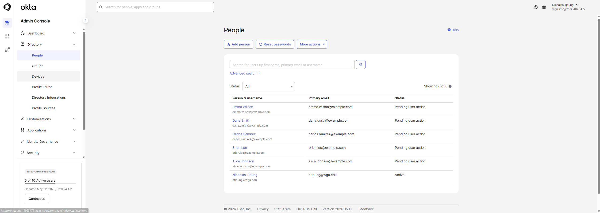
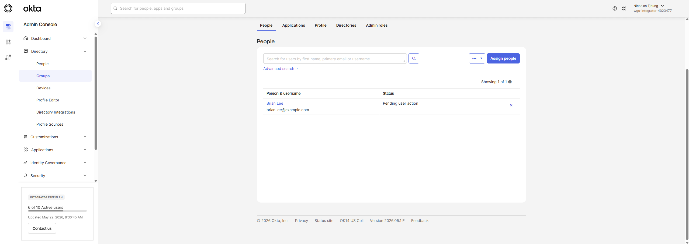
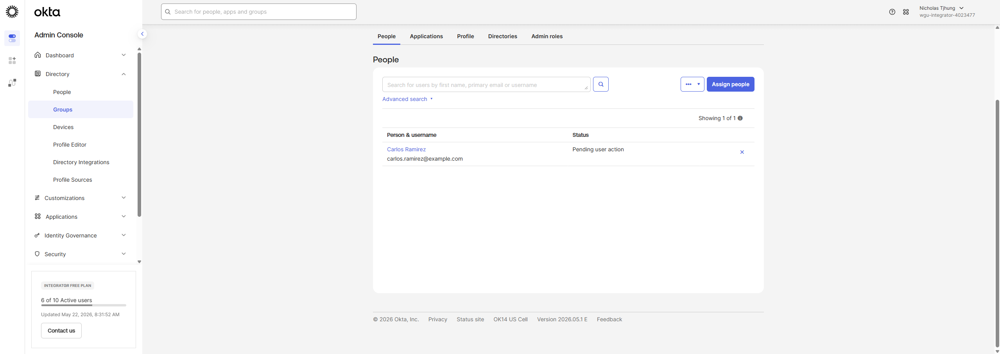
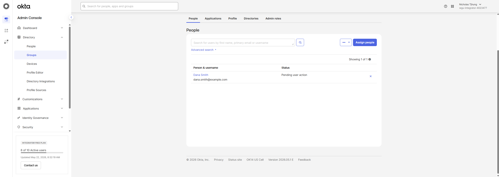
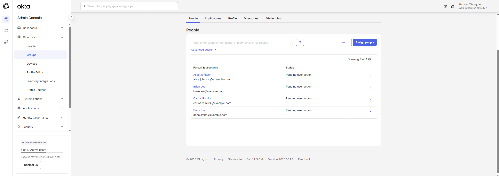
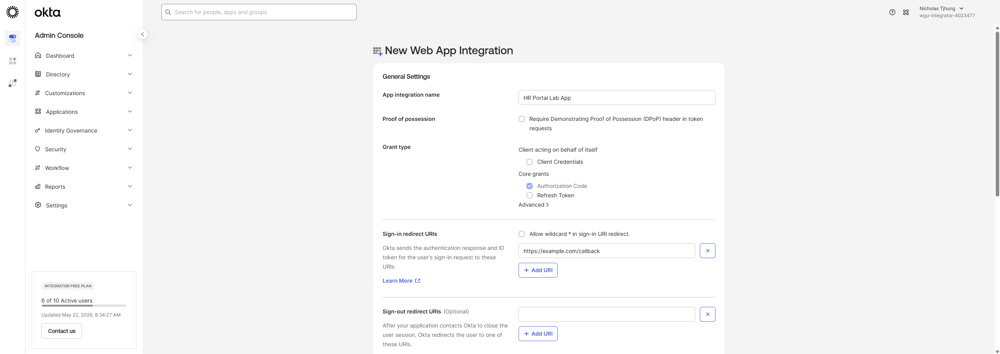
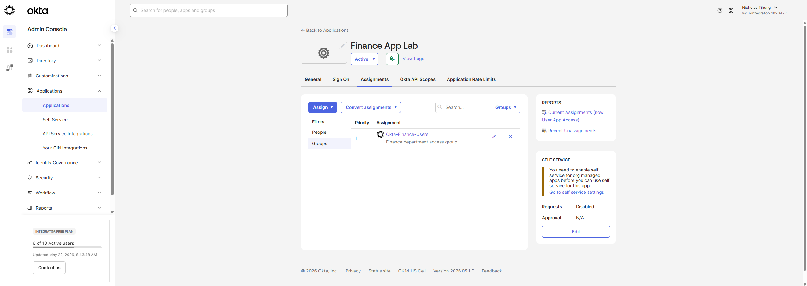

# Okta SSO and MFA Integration Lab

## Project Overview

This project demonstrates a basic Okta Identity and Access Management lab focused on users, groups, application assignment, single sign-on concepts, MFA policy planning, troubleshooting, and IAM documentation.

The purpose of this lab is to show how Okta can be used to centralize access management and improve authentication security for users and applications.

## Business Problem

Organizations often use multiple cloud applications, and managing access manually can create security and operational issues. Okta helps centralize user access, group-based application assignment, single sign-on, and multi-factor authentication.

## Tools Used

- Okta
- Okta Integrator Free Plan
- Users and groups
- Application assignments
- MFA policy planning
- SSO concepts
- GitHub documentation
- Screenshots as audit evidence

## What This Project Demonstrates

- Okta user administration
- Okta group administration
- Group-based application assignment
- SSO planning
- MFA policy documentation
- IAM troubleshooting notes
- Access control documentation
- Audit evidence collection

## Lab Structure

### Example Users

- Alice Johnson - HR Manager
- Brian Lee - Finance Analyst
- Carlos Ramirez - IT Helpdesk Technician
- Dana Smith - Project Contractor
- Emma Wilson - Sales Representative

### Example Groups

- Okta-HR-Users
- Okta-Finance-Users
- Okta-IT-Admins
- Okta-Contractors
- Okta-Sales-Users
- Okta-MFA-Required

## Project Files

- docs/
- sample-data/
- screenshots/

## Documentation Created

- docs/Okta-User-Group-Plan.md
- docs/App-Assignment-Matrix.md
- docs/MFA-Policy.md
- docs/Troubleshooting-Notes.md
- sample-data/okta-users.csv

## Lab Screenshots

### Okta Groups List

### Okta Users List

### HR Group Members

### Finance Group Members

### IT Admins Group Members

### Contractors Group Members

### MFA Required Group Members

### HR Portal Lab App

### App Group Assignment

### Finance App Assignment

### Okta Authenticators

## Key IAM Concepts Demonstrated

### Single Sign-On

Single sign-on allows users to access assigned applications through a centralized identity provider.

### MFA

Multi-factor authentication helps protect accounts by requiring additional verification beyond a password.

### Group-Based Access

Group-based access allows users to receive application access based on department, role, or access need.

### Least Privilege

Users should only receive access required for their job responsibilities.

### App Assignment

Application access was assigned through groups instead of assigning access broadly to all users. This supports cleaner IAM administration and easier access reviews.

### Troubleshooting

The troubleshooting notes document common IAM support scenarios such as users missing app access, unexpected MFA prompts, missing MFA prompts, contractor access issues, and admin access reviews.

## Resume Bullet

- Built an Okta SSO and MFA lab with users, groups, group-based application assignment, MFA policy documentation, access control planning, troubleshooting notes, and audit evidence screenshots.

## Status

Completed Okta SSO and MFA integration lab with users, groups, application assignments, MFA policy documentation, troubleshooting notes, and screenshots.
